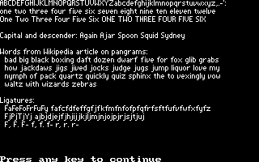

# qbtextrend
A Microsoft QBasic program that reads text from a file and renders it in CGA graphics mode (SCREEN 1) in a variable-width font.
The font can be customized by editing another text file.
To improve kerning, there's yet another text file that specifies ligatures (pairs of characters to omit horizontal spacing from between).

